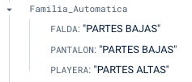

# Helper Catalogs

Este es un nodo en Firebase Realtime DB de Materiales para ayudarnos con varias transformaciones y reglas que se tienen que seguir para el envío del material a SAP. La mayoría se tratan de transformar un valor que tenemos o que calculamos en IBN en un valor que SAP acepta en su configuración.

## CanalDistribucion
//TODO

## CaracteristicasMat
Este valor es calculado a partir de Division y Genero con el siguiente formato: `P_<DIVISION>_<GENERO>` pero esto resultaría en `P_ACCESORIOS_HOMBRE` `P_CALZADO_INFANTILES` y en SAP los valores requeridos ya sea por longitud de caracteres, agrupación de artículos similares o porque así los dieron de alta manualmente son `P_ACCESORIOS_ADULT` `P_CALZADO_INFANTIL`

## Categorias
> `/Categorias` parece tener un formato y transformación similar a `/CaracteristicasMat`... ¿lo necesitamos repetido?

## Colores
Estos son los valores permitidos en SAP para colores... ¿ya los tenemos en las transformaciones que se aplican en la carga de catálogo?

## Centros
//TODO

## Deportes
Transforma `producto.Deporte` en una clave de 3 caracteres que es la que SAP espera recibir.

## Division
Transforma `producto.Division` en una clave de 3 caracteres que es la que SAP espera recibir.

## Familia
> Deprecated. Familia pasará a ser Silueta y ahora la Familia será calculada automáticamente.

Transforma `producto.Familia` en una clave de 3 caracteres que es la que SAP espera recibir.

## FamiliaAutomatica
Este HelperCatalog ayudará a obtener el valor para el campo `producto.Familia` a partir de `producto.Silueta`. Es un campo para uso interno de Innovasport y el proveedor no conoce.

## Generos
Transforma `producto.Genero` en una clave de 3 caracteres que es la que SAP espera recibir.

## GrupoCompras
Este HelperCatalog ayuda a conseguir una clave de 3 caracteres que SAP espera recibir. Se basa en `producto.Division`

## Marcas
Transforma `producto.Marca` en una clave de 3 caracteres que es la que SAP espera recibir.

## OrganizacionCompras
Transforma el banner seleccionado en una clave que SAP espera recibir. Se usa para los segmentos 1, 3 y 4

## R98_Jerarquias
En este nodo se guarda lo recibido por la interfaz de réplica de Jerarquías R98. Las jerarquías nacen en SAP y se le comparten a IBN por medio de esta.

El nodo `R98_Jerarquias` guarda tal cual lo que se recibe por la interfaz, con mínimos cambios. Sin embargo las jerarquías recibidas se aprovechan para alimentar otros `HelperCatalogs`.

## R99_GpoArticulos
En este nodo se guarda lo recibido por la interfaz de réplica de gpoArtículos R99. Por el momento esa información no se usa en otro lado (2024-02-27).

## Segmento1Tallas
A partir de [CaracteristicasMat](#caracteristicasmat) se le tiene que especificar a SAP un valor para la `R52/E1BPE1AUSPRTX`

## Segmento6Surtido
Nos ayuda a hacer una transormación de los banners seleccionados al valor con el que están registrados en SAP. Esto se usa en el segmento 6 de Catalogación.

## Silueta
Lo que antes era Familia, ahora es Silueta. Este nodo sirve para transformar la Silueta en una clave de 3 caracteres que SAP espera recibir.

## Surtido
En este nodo tenemos el detalle de qué tiendas/centros pertenecen a qué banner, se usa en la `R52/E1BPE1MARCRT`

## Tallas
//TODO